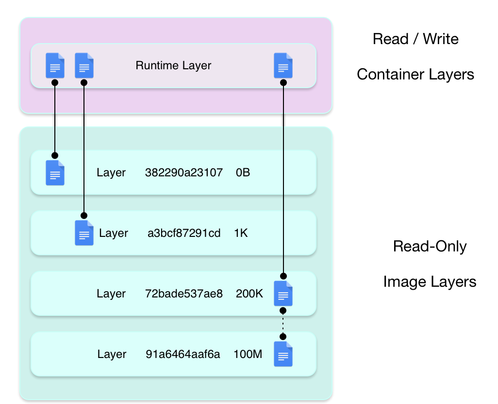

<i class="fab fa-docker fa-3x" style="color: #78b9e6"></i>
# Docker

## Rapide & efficace

par <strong>Julien Bourgoin</strong> & <strong>Stéphane Daviet</strong>

---

# Pourquoi Docker ?


!!!

STÉPHANE

--- ---

## Un plébiscite

> 37 milliards de pull d'images fin 2018


--- ---

## Quelques éléments clés

<ul>
    <li class="fragment" data-fragment-index="1">Open-source,</li>
    <li class="fragment" data-fragment-index="2">Facilite la mise en œuvre d'architecture Cloud (twelve factors),</li>
    <li class="fragment" data-fragment-index="3">Écosystème riche,</li>
    <li class="fragment" data-fragment-index="4">Basé sur des technos éprouvées (HTTP, cgroup & namespace, layer FS).</li>
</ul>

!!!

STÉPHANE

--- ---

## Pourquoi le succès Docker ?

Facilité d'utilisation & conception ingénieuse :
<!-- Nécessité de passer par des ul/li pour avoir l'affichage étape par étapr (fragments) sans que les puces soient préaffichées. -->
<ul>
    <li class="fragment" data-fragment-index="1">le **registre** pour stocker & récupérer des images prêtes à l'emploi,</li>
    <li class="fragment" data-fragment-index="2">**Dockerfile** pour décrire la construction d'une image,</li>
    <li class="fragment" data-fragment-index="3">**Docker client** pour lancer simplement les actions usuelles (en commandant un démon),</li>
    <li class="fragment" data-fragment-index="4">images basées sur des **système de fichiers en couches** très efficace (optimisation de la taille).</li>
</ul>

!!!

STÉPHANE

--- ---

## Le registre

> 1,8 million d'images disponibles


!!!

STÉPHANE
* Repository public & privé d'images Docker (par défaut à l'install), à la npm
* Système de notation communautaire
* Images officielles & library
* Vulnerability security scanning
* Recherche possible avec la commande `docker search`

---

# Le client


!!!

JULIEN

--- ---

### Connexion avec le démon

<div class="rows">
    <div class="shell up">
        <iframe data-src="http://localhost:8080"></iframe>
    </div>
    <div>
        <ul>
            <li>Démon = service système</li>
            <li>Protocole HTTP & API REST</li>
        </ul>
    </div>
</div>

!!!

JULIEN
1. `service docker status`
2. `curl --unix-socket /var/run/docker.sock http://localhost/images/json | jq .`
3. `docker version`

--- ---

## Manipulation des images

<div class="rows">
    <div class="shell up">
        <iframe data-src="http://localhost:8080"></iframe>
    </div>
    <div>
        <ul>
            <li>Récupération : <code>docker pull &lt;image-name&gt;<sup>[1]</sup></code></li>
            <li>Listing : <code>docker images -a</code></li>
            <li>Suppression : <code>docker rmi &lt;image-name&gt;</code></li>
        </ul>
    </div>
</div>
<div class="footnote"><sup>[1]</sup> Nom complet : [registry-url/]image-name[:version]</div>

!!!

JULIEN
1. `docker pull alpine`
2. `docker images -a`
3. `docker rmi alpine`

--- ---

## Les conteneurs

<div class="rows">
    <div class="shell up">
        <iframe data-src="http://localhost:8080"></iframe>
    </div>
    <div>
        <ul>
            <li>Exécution : <code>docker run -t &lt;container-name&gt; &lt;image-name&gt;</code></li>
            <li>Listing : <code>docker ps -a</code></li>
            <li>Suppression : <code>docker rm &lt;container-name&gt;</code></li>
            <li>Exécution intra conteneur : <code>docker exec -it &lt;container-name&gt; &lt;command&gt;</code></li>
    </div>
</div>

!!!

JULIEN
* `docker run hello-world`
* `docker ps -a`
* `docker run -it alpine`

---

# Le Dockerfile

!!!

STÉPHANE

--- ---

## Anatomie

Une grammaire simple :
```dockerfile
FROM openjdk:8u111-alpine

RUN addgroup -g 10064 dck && adduser -S -u 10064 -G dck admdck
RUN mkdir -p app

VOLUME /etc/localtime:/etc/localtime:ro
ENV _JAVA_OPTIONS="-Duser.timezone=Europe/Paris"

WORKDIR /app
COPY target/app.jar .

EXPOSE 8080

USER admdck
ENTRYPOINT java
CMD ["-jar", "app.jar"]
```

!!!

* STÉPHANE : Explication de chacune des instructions :
  * `FROM` : image de base,
  * `RUN` : exécution d'une commande,
  * `VOLUME` : partage d'un volume avec l'hôte,
  * `ENV` : déclaration de variable d'environnement,
  * `COPY` : copie d'un élément de l'hôte dans l'image,
  * `WORKDIR` : définition du répertoir de travail,
  * `EXPOSE` : port exposé,
  * `USER` : utilisateur exécutant les prochaines commandes,
  * `ENTRYPOINT` : commande executée lors du démarrage d'un container basé sur cette image
  * `CMD` : paramètres par défaut de l'ENTRYPOINT
  * et quelques autres…

--- ---

## Création & publication d'une image

<div class="rows">
    <div class="shell up">
        <iframe data-src="http://localhost:8080"></iframe>
    </div>
    <div>
        <ul>
            <li>Construction : <code>docker build -t &lt;image-name&gt; .</code></li>
            <li>Authentification au registre : <code>docker login &lt;registry-url&gt;</code></li>
            <li>Nommage : <code>docker tag &lt;source-image-name&gt; &lt;target-image-name&gt;</code></li>
            <li>Récupération : <code>docker push &lt;image-name&gt;</code></li>
        </ul>
    </div>
</div>

!!!

STÉPHANE
* `cd builds/webpage`
* `docker build -t webpage .`
* `docker run -d --name=webpage webpage`
* `docker tag webpage stephanedaviet/webpage:latest`
* `docker push stephanedaviet/webpage:latest`

--- ---

## Build multi-stages

<div class="cols">
    <div class="shell left">
        <iframe data-src="http://localhost:8080"></iframe>
    </div>
    <div>
        <!-- &nbsp; = astuce pour éviter une ligne vide, bug renderer marked -->
        <pre><code class="dockerfile">FROM golang:alpine AS build-env
RUN mkdir /src
ADD hello.go /src
RUN cd /src && go build -o goapp
&nbsp;
FROM alpine
WORKDIR /app
COPY --from=build-env /src/goapp /app/
ENTRYPOINT ./goapp</code></pre>
    </div>
</div>

!!!

STÉPHANE
* `cd builds/multistage`
* `docker build -f Dockerfile -t multistage/hello .`
* `docker run --rm multistage/hello`
* `docker history multistage/hello`
* `docker images`

L'image golang:alpine fait 287Mo, quand l'image finale de l'application fait 5,71Mo

---

# Layers


!!!

JULIEN

--- ---

## Docker pull

<div class="rows">
    <div class="shell up">
        <iframe data-src="http://localhost:8080"></iframe>
    </div>
    <div>
        <ul>Une image est constituée de plusieurs couches :
            <li>celles des images sur lesquelles elle se base directement & transitivement,</li>
            <li>celles introduites par les instructions de son Dockerfile.</li>
        </ul>
    </div>
</div>

!!!

JULIEN
* Téléchargement image de base : `docker pull debian:jessie-slim`
* Téléchargement image Node basé sur la première : `docker pull node:carbon-jessie-slim`

--- ---

## Dockerfile

<div class="rows">
    <div>
        <ul>
            <li><strong>1 instruction = 1 layer,</strong></li>
            <li>principes si reconstruction d'une image  :
                <ul>
                    <li>si ligne non modifiée → réutilisation du layer associé conservé en cache (<i class="fas fa-exclamation-triangle" style="color: orange"></i>),</li>
                    <li>si ligne modifiée → reconstruction du layer associé et tous les suivants.</li>
                </ul>
            </li>
            <li><i class="fas fa-exclamation-triangle" style="color: orange"></i> Optimiser l'ordre des instructions pour éviter trop de reconstruction des layers (regrouper les instructions RUN).</li>
        </ul>
    </div>
    <div class="cols" style="width: 100%">
        <div class="shell left" style="flex: 1 1 auto">
            <iframe data-src="http://localhost:8080"></iframe>
        </div>
        <div class="shell right" style="flex: 1 1 auto">
            <iframe data-src="http://localhost:8080"></iframe>
        </div>
    </div>
</div>

!!!

JULIEN
* `cd builds/layers`
* `docker build -f Dockerfile.dumb -t testlayer-dumb .`
* `docker build -f Dockerfile.better -t testlayer-better .`

--- ---

## Layered filesystems



* Stockage des layers basé sur des <strong>systèmes de fichiers pré-existants</strong> (_storage drivers_) : _UnionFS, AuFS, Btrfs, zfs, overlay, <strong>overlay2</strong>, devicemapper_,
* Sur des systèmes utilisants <abbr title="Logical Volume Manager">LVM</abbr>, privilégier l'utilisation de _devicemapper_.

!!!

JULIEN

---

# Liens avec l'hôte


!!!

STÉPHANE

--- ---

## Exposition de ports

<div class="rows">
    <div class="cols" style="width: 100%">
        <div class="shell left" style="flex: 1 1 auto">
            <iframe data-src="http://localhost:8080"></iframe>
        </div>
        <div class="shell right" style="flex: 1 1 auto">
            <div style="height: 1.2em; background-color: lightgray; text-align: left; padding: 0.1em 0.2em; border-bottom: solid 1px black">http://localhost</div>
            <div style="border: solid 1px white; background-color: white; padding: 0.2em">
                <iframe style="height: calc(300px - 1.2em)" data-src="http://localhost"></iframe>
            </div>
        </div>
    </div>
    <div>
        <ul>
            <li>Mapping : <code>docker run -p &lt;port-externe&gt;:&lt;port-interne&gt; &lt;image-name&gt;</code></li>
        </ul>
    </div>
</div>

!!!

STÉPHANE

* `cd builds/webpage`
* `docker ps`
* Refresh de la page
* `docker stop webpage`
* `docker rm webpage`
* `docker run -d -p 80:80 webpage`

--- ---

## Montage de volumes

<div class="rows">
    <div>
        <iframe data-src="http://localhost:8080"></iframe>
    </div>
    <div>
        <ul>
            <li>Mapping : <code>docker run -v &lt;port-externe&gt;:&lt;port-interne&gt; &lt;image-name&gt;</code></li>
        </ul>
    </div>
</div>

!!!

STÉPHANE
* `cd builds/webpage`
* `docker run -v .:/usr/share/nginx/html/ -d --name=server nginx`
* Refresh de la page
* Édition `vim index.html`
* Refresh de la page

---

# Sécurité

!!!

Julien

--- ---

## <i class="fas fa-exclamation-triangle" style="color: red"></i> Attention aux images mal intentionnées !

<div class="rows">
    <div>
        <ul>
            <li>Utiliser en priorité les <strong>images officielles</strong></li>
            <li>Toujours <strong>regarder le Dockerfile</strong></li>
            <li>S'assurer que l'image a été <strong>générée avec</strong> ce Dockerfile</li>
            <li>Vérifier les ressources téléchargées via `wget` ou `curl` ou `ADD`</li>
            <li>Privilégier les <strong>images bien notées</strong></li>
			<li>Si possible, <strong>se faire sa propre image</strong></li>
        </ul>
    </div>
</div>

!!!

Julien

--- ---

## Élévation de privilèges

<div class="rows">
    <div class="shell up">
        <iframe data-src="http://localhost:8080"></iframe>
    </div>
    <div>
        <ul>
            <li>Penser à remapper les users via le mécanisme de _user namespacing_ (`userns-remap`).</li>
        </ul>
    </div>
</div>

!!!

Julien

* `ls -al /root/secret.txt`
* `docker run --rm -v /tmp:/tmp alpine cat /tmp/secret.txt`

---

# Docker In Docker In Docker In…


!!!

Julien

--- ---

## Le faux Docker in Docker

<div class="rows">
    <div class="shell up">
        <iframe data-src="http://localhost:8080"></iframe>
    </div>
    <div>
        <ul>
            <li>Installation du client docker dans l'image</li>
            <li>Montage du socker unix du démon de l'hôte dans le container</li>
        </ul>
    </div>
</div>

!!!

Julien

* `cd builds/dind`
* `docker build -t julien:docker-client .`
* `docker run --rm -v /var/run/docker.sock:/var/run/docker.sock julien:docker-client docker version`

--- ---

## Le vrai

<div class="rows">
    <div>
        <ul>
            <li>Mise en oeuvre facilitée avec l'image "docker:dind"</li>
            <li>Cas d'usages très particuliers</li>
            <li>Restrictions diverses et variées (sur les FS notamment)</li>
        </ul>
    </div>
</div>

!!!

Julien

* `docker run --privileged -d docker:dind`

---

# Quelques liens

---

# Vos questions